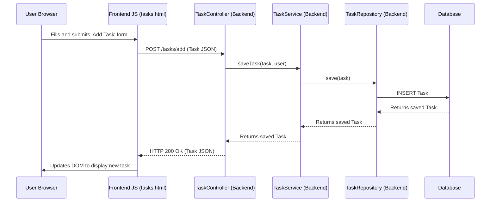

# Task Manager - Spring Boot + Static HTML/JS Application

A simple task management application built with Spring Boot for the backend and static HTML, Tailwind CSS, and vanilla JavaScript for the frontend. It allows users to register, log in, and manage their tasks (add, view, edit, delete, mark complete, set priority, set due date).

## Overview

This project demonstrates a basic web application structure using Spring Boot for RESTful APIs and a client-side rendered frontend for a dynamic user experience.

## Features

*   **User Authentication:**
    *   User registration
    *   User login
*   **Task Management:**
    *   Add new tasks with description, priority, and due date.
    *   View all tasks.
    *   Edit existing tasks (description, priority, due date, completion status).
    *   Delete individual tasks.
    *   Mark tasks as complete/incomplete.
    *   Client-side sorting of tasks by priority (High to Low) and then by due date (earliest first).
    *   "Clear All Tasks" functionality.
*   **Data Seeding:**
    *   An initial 'admin' user is created.
    *   Sample tasks are seeded for the 'admin' user.

## Components

### Backend (Spring Boot)

*   **Framework:** Spring Boot is used for building the RESTful API.
*   **Data Persistence:** Spring Data JPA for database interactions.
*   **Database:** H2 in-memory database (default for Spring Boot, can be configured for others like PostgreSQL in `application.properties`). `spring.jpa.hibernate.ddl-auto=update` allows Hibernate to automatically update the database schema.
*   **API:** RESTful endpoints are defined in `com.taskmanager.controller` to handle requests from the frontend.
    *   `AuthController`: Handles user registration (`/auth/register`) and login (`/auth/login`).
    *   `TaskController`: Handles all task-related CRUD operations (`/tasks`, `/tasks/add`, `/tasks/{id}`, `/tasks/all`).
*   **Business Logic:** Services in `com.taskmanager.service` encapsulate the core application logic.
    *   `UserService`: Manages user creation and retrieval.
    *   `TaskService`: Manages task creation, retrieval, updates, and deletion.
*   **Data Models:** Entities in `com.taskmanager.model` represent the database tables.
    *   `User`: Stores user credentials.
    *   `Task`: Stores task details including description, priority (integer), completed (boolean), and dueDate (LocalDate).
*   **Repositories:** Interfaces in `com.taskmanager.repository` extend `JpaRepository` for CRUD operations.
*   **Initial Data:** `TaskManagerApplication.java` includes a `CommandLineRunner` to seed initial user and task data.

### Frontend (Static HTML, Tailwind CSS, Vanilla JavaScript)

*   **Structure:** HTML files located in `src/main/resources/static/` define the user interface (`index.html` (redirects to login/tasks), `login.html`, `register.html`, `tasks.html`).
*   **Styling:** Tailwind CSS (via CDN) is used for utility-first styling.
*   **Interactivity:** Vanilla JavaScript embedded within `<script>` tags in `tasks.html` (and other pages for auth) handles:
    *   **API Interaction:** Using the `fetch` API to communicate with the Spring Boot backend.
    *   **DOM Manipulation:** Dynamically rendering and updating the task list and forms.
    *   **Form Handling:** Capturing user input for registration, login, and task management.
    *   **Session Management:** Uses `sessionStorage` to store the logged-in user's username. Redirects to `login.html` if API calls result in 401/403 errors, indicating an unauthorized or unauthenticated user.
    *   **UI Feedback:** Basic error handling and visual cues for task priority and completion.

## Project Structure

*   `src/main/java/com/taskmanager/`: Root package for Java source code.
    *   `controller/`: Spring MVC controllers for handling HTTP requests.
    *   `model/`: JPA entities.
    *   `repository/`: Spring Data JPA repositories.
    *   `service/`: Business logic services.
    *   `TaskManagerApplication.java`: Main Spring Boot application class and data seeder.
*   `src/main/resources/`:
    *   `application.properties`: Spring Boot configuration (e.g., database settings).
    *   `static/`: Static web assets (HTML, JS, CSS if not using CDN).
*   `pom.xml`: Maven project configuration.

## User Request Flow (Example: Adding a Task)

1.  **User Interaction:** User fills out the "Add Task" form on `tasks.html` and clicks "Add Task".
2.  **Frontend JS (`tasks.html`):**
    *   Captures form data (description, priority, due date).
    *   Constructs a JSON payload.
    *   Makes an asynchronous `fetch` request (`POST /tasks/add`) to the backend.
3.  **Backend `TaskController`:**
    *   The `addTask` method receives the request.
    *   Retrieves the currently logged-in user from the HTTP session.
    *   If no user is logged in, returns a 401 Unauthorized error.
    *   Calls `taskService.saveTask(task, user)`.
4.  **Backend `TaskService`:**
    *   The `saveTask` method sets the user for the task and saves it using `taskRepository.save(task)`.
    *   Returns the saved task.
5.  **Backend `TaskController`:**
    *   Returns the newly created task as JSON with a 200 OK status.
6.  **Frontend JS (`tasks.html`):**
    *   The `fetch` callback receives the response.
    *   If successful, it dynamically adds the new task to the displayed list on the page.
    *   Clears the form.



## Setup and Running

### Prerequisites

*   **Java Development Kit (JDK):** Version 17 or later.
*   **Apache Maven:** To build and run the project.

### Configuration

*   The application uses an H2 in-memory database by default. No specific database setup is required for basic operation.
*   If you wish to use a persistent database like PostgreSQL, configure the connection details in `src/main/resources/application.properties`.

### Running the Application

1.  **Clone the repository (if applicable) or ensure you have the project files.**
2.  **Navigate to the project root directory** in a terminal or command prompt.
    (e.g., `d:\\Development\\DreamCoil\\bugfix\\ratih\\TugasBesar_PBO\\`)
3.  **Run with Maven:**
    ```bash
    mvn spring-boot:run
    ```
    On Windows, if `mvn` is not in PATH but `mvnw.cmd` is present:
    ```bash
    .\\mvnw.cmd spring-boot:run
    ```
4.  **Access:** Once Spring Boot starts (typically on port 8080), open your web browser and navigate to:
    *   `http://localhost:8080/` (should redirect to login or tasks)
    *   `http://localhost:8080/login.html` to log in.
    *   `http://localhost:8080/register.html` to create a new account.

    The seeded 'admin' user has credentials:
    *   Username: `admin`
    *   Password: `password`

## API Endpoints

### Auth Controller (`/auth`)

*   `POST /register`: Registers a new user.
    *   Request Body: `{"username": "user", "password": "password"}`
    *   Response: Success message or error.
*   `POST /login`: Logs in an existing user.
    *   Request Body: `{"username": "user", "password": "password"}`
    *   Response: Success message or error. Sets user in session.
*   `POST /logout`: Logs out the current user.
    *   Response: Success message. Clears user from session.

### Task Controller (`/tasks`)

*All endpoints require an authenticated user session.*

*   `GET /`: Retrieves all tasks for the logged-in user.
    *   Response: `List<Task>`
*   `POST /add`: Adds a new task for the logged-in user.
    *   Request Body: `Task` JSON (e.g., `{"description": "New Task", "priority": 1, "dueDate": "YYYY-MM-DD"}`)
    *   Response: Created `Task` object.
*   `PUT /{id}`: Updates an existing task by its ID.
    *   Request Body: `Task` JSON with fields to update.
    *   Response: Updated `Task` object.
*   `DELETE /{id}`: Deletes a task by its ID.
    *   Response: Success message or error.
*   `DELETE /all`: Deletes all tasks for the logged-in user.
    *   Response: Success message or error.

## Future Enhancements / Considerations

*   **Security:** Implement Spring Security for robust authentication and authorization.
*   **Error Handling:** More sophisticated global error handling and user feedback.
*   **Input Validation:** Comprehensive server-side and client-side input validation.
*   **Frontend Framework:** Consider a JavaScript framework (React, Vue, Angular) for more complex UIs.
*   **Testing:** Add more comprehensive unit and integration tests.
*   **Password Hashing:** Ensure strong password hashing is used (Spring Security typically handles this).