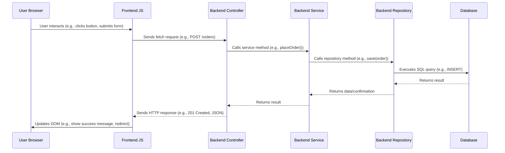

# Task Manager ✅ - Aplikasi Manajemen Tugas dengan Spring Boot & HTML Statis

Task Manager adalah aplikasi web sederhana untuk mencatat dan mengelola tugas harian. Backend dibangun dengan Spring Boot, sedangkan antarmuka pengguna dibuat dengan HTML/CSS/JavaScript statis. Cocok untuk pengguna individu, keperluan pembelajaran, atau pengembangan dasar aplikasi manajemen tugas.

## Overview

Aplikasi ini memungkinkan pengguna untuk registrasi, login, dan mengelola daftar tugas seperti menambahkan, mengedit, menyelesaikan, atau menghapus tugas. Semua interaksi dilakukan melalui antarmuka web ringan yang langsung berkomunikasi dengan REST API di backend.

## Components

### Backend (Spring Boot)

*   **Framework:** [Spring Boot 3.4.5]sebagai kerangka kerja utama REST API.
*   **Database:** Terhubung dengan PostgreSQL (konfigurasi di application.properties), dengan Hibernate yang secara otomatis mengatur skema database (spring.jpa.hibernate.ddl-auto=update).
*   **Pengelolaan Data:** User → Entitas pengguna aplikasi.
Task → Entitas tugas dengan informasi seperti judul, deskripsi, status, dan pengguna terkait.
*   **Controller:** AuthController → Menangani registrasi dan login.
TaskController → Menangani operasi CRUD tugas.
*   **Service Layer:** UserService dan TaskService menangani logika bisnis dan interaksi database.
*   **Repositories:** UserRepository dan TaskRepository menggunakan JpaRepository untuk akses data.
*   **Seeder Opsional:** Logika untuk menambahkan data awal (jika diperlukan) dapat ditambahkan di TaskManagerApplication.java menggunakan CommandLineRunner.

### Frontend (Static HTML, Tailwind CSS, JavaScript)

*   **Structure:** (berada di folder static/):
  1. index.html → Halaman utama
  2. login.html → Form login
  3. register.html → Form registrasi
  4. tasks.html → Dashboard manajemen tugas
*   **JavaScript:**Menggunakan fetch() untuk berkomunikasi dengan backend
Menyimpan status login sederhana dengan sessionStorage
Menampilkan notifikasi dan memperbarui tampilan halaman secara dinamis


## Project Structure
*   `src/main/java/com/taskmanager/`: Root package for Java source code.
    *   `controller/`: AuthController.java, TaskController.java
    *   `model/`: Task.java, User.java
    *   `repository/`: TaskRepository.java, UserRepository.java
    *   `service/`: TaskService.java, UserService.java
    *   `TaskManagerApplication.java`: Kelas utama dan entry point Spring Boot
*   `src/main/resources/`: Contains non-Java resources.
    *   `application.properties`: Konfigurasi database dan server.
    *   `static/`:
                * `index.html`  
*   `src/test/java/`: Contains unit and integration tests (basic context load test included).
*   `pom.xml`: Maven project configuration file, defining dependencies (Spring Boot starters, Lombok, PostgreSQL driver) and build settings.
*   `target/`: Directory where Maven places compiled code and packaged artifacts (ignored by Git).

## User Request Flow

1.  **User Interaction:** The user interacts with the HTML pages in their browser (e.g., fills the login form, selects materials on the order page).
2.  **Frontend JS:** JavaScript captures the user action and makes an asynchronous `fetch` request to the appropriate backend API endpoint (e.g., `POST /auth/login`, `GET /materials`, `POST /orders`).
3.  **Backend Controller:** The Spring Boot `RestController` matching the request path receives the request.
4.  **Backend Service:** The controller calls the relevant `Service` method to perform the business logic (e.g., validate credentials, fetch data from the database, update stock, save new order).
5.  **Backend Repository:** The service interacts with `JpaRepository` interfaces to perform database operations (querying, saving, updating entities).
6.  **Backend Response:** The controller receives the result from the service and sends an HTTP response (usually JSON data or an HTTP status code) back to the browser.
7.  **Frontend JS:** The JavaScript `fetch` callback receives the response, processes the data (if any), and updates the HTML DOM to reflect the changes (e.g., shows a success message, redirects the user, displays the order list).
8.  **User Sees Update:** The user sees the updated UI in their browser.



## Setup and Running

### Prerequisites

*   **Java Development Kit (JDK):** Version 21 or later.
*   **Apache Maven:** To build and run the project.
*   **PostgreSQL Database:** A running instance accessible to the application. You can use a local installation, Docker, or a cloud service like Neon (as configured in `application.properties`).

### Configuration

1.  **Database:**
    *   Ensure you have a PostgreSQL database created.
    *   Update the `spring.datasource.url`, `spring.datasource.username`, and `spring.datasource.password` properties in `src/main/resources/application.properties` to match your database connection details. The current configuration points to a Neon cloud database.

### Running the Application

1.  **Navigate:** Open a terminal or command prompt in the project's root directory (`d:\Development\Satoru\kael\kael\`).
2.  **Run with Maven:** Execute the following Maven command:
    ```bash
    mvn spring-boot:run
    ```
    (Use `mvnw.cmd spring-boot:run` on Windows Command Prompt)
3.  **Access:** Once Spring Boot starts (look for `Tomcat started on port(s): 8080`), open your web browser and navigate to `http://localhost:8080`.

You should see the landing page (`index.html`). You can then navigate to the login page (`/login.html`) and use the default credentials (cashier/pass or manager/adminpass) seeded by the `CommandLineRunner`.
