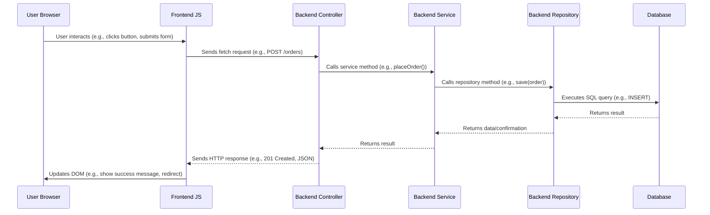

# Task Manager ✅ - Aplikasi Manajemen Tugas dengan Spring Boot & HTML Statis

Task Manager adalah aplikasi web sederhana untuk mencatat dan mengelola tugas harian. Backend dibangun dengan Spring Boot, sedangkan antarmuka pengguna dibuat dengan HTML/CSS/JavaScript statis. Cocok untuk pengguna individu, keperluan pembelajaran, atau pengembangan dasar aplikasi manajemen tugas.

## Overview

Aplikasi ini memungkinkan pengguna untuk registrasi, login, dan mengelola daftar tugas seperti menambahkan, mengedit, menyelesaikan, atau menghapus tugas. Semua interaksi dilakukan melalui antarmuka web ringan yang langsung berkomunikasi dengan REST API di backend.

## Components

### Backend (Spring Boot)

*   **Framework:** [Spring Boot 3.4.5]sebagai kerangka kerja utama REST API.
*   **Database:** Terhubung dengan PostgreSQL (konfigurasi di application.properties), dengan Hibernate yang secara otomatis mengatur skema database (spring.jpa.hibernate.ddl-auto=update).
*   **Pengelolaan Data:** User → Entitas pengguna aplikasi.
Task → Entitas tugas dengan informasi seperti judul, deskripsi, status, dan pengguna terkait.
*   **Controller:** AuthController → Menangani registrasi dan login.
TaskController → Menangani operasi CRUD tugas.
*   **Service Layer:** UserService dan TaskService menangani logika bisnis dan interaksi database.
*   **Repositories:** UserRepository dan TaskRepository menggunakan JpaRepository untuk akses data.
*   **Seeder Opsional:** Logika untuk menambahkan data awal (jika diperlukan) dapat ditambahkan di TaskManagerApplication.java menggunakan CommandLineRunner.

### Frontend (Static HTML, Tailwind CSS, JavaScript)

*   **Structure:** (berada di folder static/):
  1. index.html → Halaman utama
  2. login.html → Form login
  3. register.html → Form registrasi
  4. tasks.html → Dashboard manajemen tugas
*   **JavaScript:**Menggunakan fetch() untuk berkomunikasi dengan backend
Menyimpan status login sederhana dengan sessionStorage
Menampilkan notifikasi dan memperbarui tampilan halaman secara dinamis


## Project Structure
*   `src/main/java/com/taskmanager/`: Root package for Java source code.
    *   `controller/`: AuthController.java, TaskController.java
    *   `model/`: Task.java, User.java
    *   `repository/`: TaskRepository.java, UserRepository.java
    *   `service/`: TaskService.java, UserService.java
    *   `TaskManagerApplication.java`: Kelas utama dan entry point Spring Boot
*   `src/main/resources/`: Contains non-Java resources.
    *   `application.properties`: Konfigurasi database dan server.
    *   `static/`:
      `index.html`, `login.html`, `register.html`, `tasks.html`
*   `src/test/java/com/taskmanager/`: `TaskManagerApplicationTests.java` → Pengujian awal aplikasi
*   `pom.xml`: Konfigurasi Maven dan dependensi
    
## User Request Flow

1.  Pengguna membuka halaman seperti login.html atau register.html.
2.  JavaScript menangani input form dan mengirim permintaan HTTP `fetch` ke backend API endpoint (`/auth/login`, `/auth/register`, `/tasks`).
3.  Controller di backend menerima permintaan dan meneruskannya ke service.
4.  Service menjalankan logika bisnis dan menggunakan repository untuk mengakses atau memodifikasi data di database.
5.  Hasil dikembalikan sebagai respons HTTP.
6.  JavaScript di frontend memperbarui tampilan sesuai hasil (menampilkan tugas, notifikasi, atau navigasi ke halaman lain).



## Setup and Running

### Prerequisites

*   **Java Development Kit (JDK):** Version 21 or later.
*   **Apache Maven** 
*   **PostgreSQL Database:** NeonDB

### Configuration

1.  **Database:**
    *   Edit file `src/main/resources/application.properties`:
    *   Update the `spring.datasource.url`, `spring.datasource.username`, and `spring.datasource.password` menyesuaikan dengan Neon cloud database.

### Running the Application

1.  Buka terminal di direktori root proyek.
2.  **Run with Maven:**
    ```bash
    mvn spring-boot:run
    ```
3.  **Access:** buka browser `http://localhost:8080`.
4.  Gunakan `register.html` untuk mendaftar akun baru. Lalu login melalui `login.html` dan kelola tugas di `tasks.html`.


